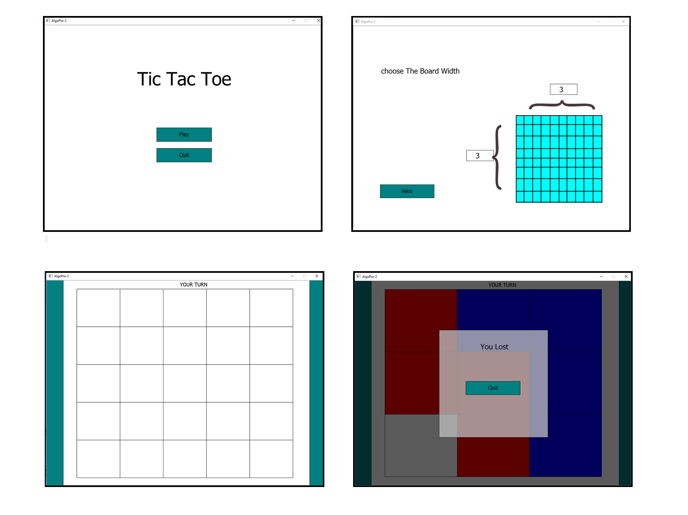

# AlphaBeta TicTacToe

This is an implementation of AlphaBeta algorithm for palying n*m Tic Tac Toe. The Graphics has been powered by QT framework for C++.

This code has been developed at **November 2017**.

Special Thanks to Abdullah Aghazadah (@MeLikeyCode) for his QT graphics tutorial in Youtube.

## Gameplay
An illustration of the gameplay has been porvided below:

